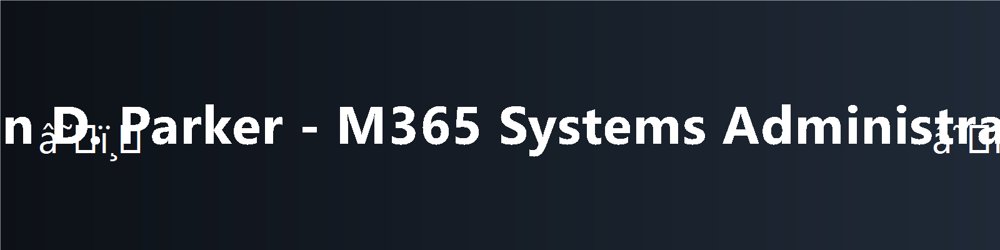
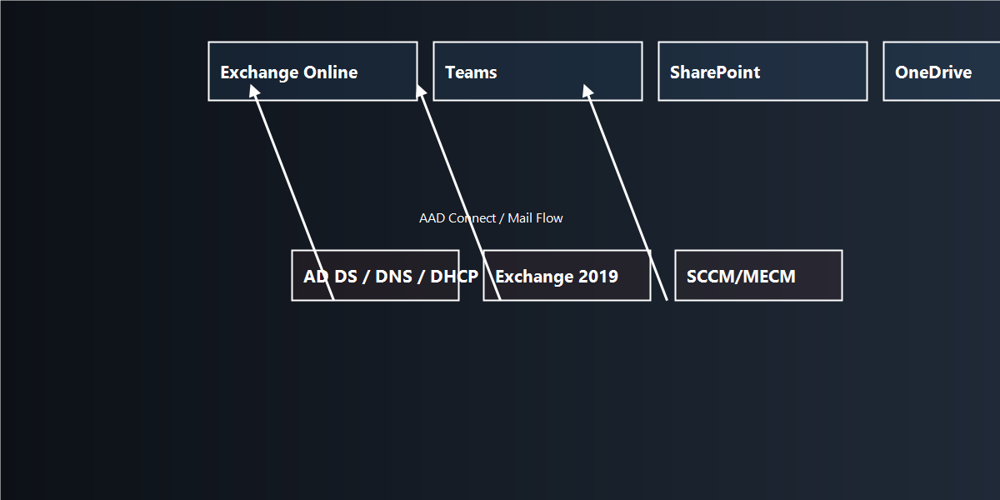

<!-- ================================================== -->
<!-- BANNER PLACEHOLDER -->

  

<!-- BADGES -->

-Identity%20Mgmt-0078D4?logo=microsoftazure&logoColor=white)

# ✨ Euron Pennyman — Microsoft 365 Systems Administrator Portfolio

Welcome to my **enterprise-ready Microsoft 365 portfolio**, showcasing hands-on experience with:

- 🔄 **Exchange Hybrid**  
- 📡 **Teams Governance**  
- 🖥 **Intune + SCCM Endpoint Management**  
- ⚙️ **PowerShell Automation**  
- 🛡 **Security + Compliance**  
- ☁️ **Entra ID (Azure AD)**

---

# 🖼 Architecture Diagram (Dark Mode / PNG)

  

# 🌐 Repository Structure
\\\
m365-systems-admin-portfolio
├── Hybrid-Lab/
├── Teams-Governance/
├── Intune-SCCM/
├── PowerShell-Automation/
└── Security-Compliance/
\\\

# 🔗 Contact

  © 2025 — John D. Parker • Microsoft 365 Systems Administrator Portfolio • Built with ❤️ and PowerShell

